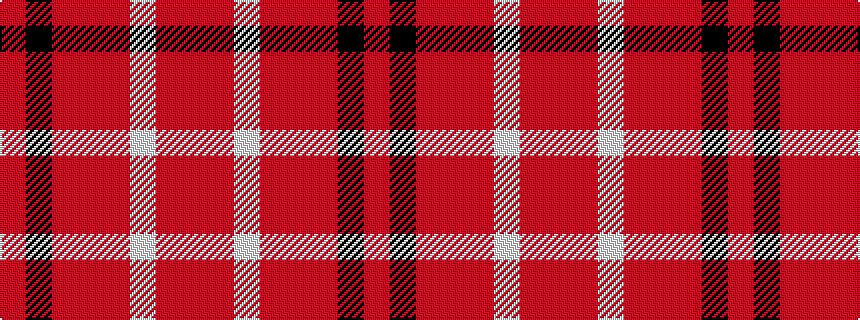

RKRRRWRR

It is a 8 stripe tartan.

<figure class="pat-woven">

<figcaption>idealised sample</figcaption>
</figure>

## Colour Sequence



## Tartans with this colour sequence

| Tartans |
|---------------|
| [Cameron Hose #2](/setts/s8/r3k2r23ri3r3w23r3ri3~x2/)|
||
| [Cameron, Hose for E](/setts/s8/r3ri3w23ri3r3ri23k2ri3~x2/)|
||
| [Hose #2](/setts/s8/r3k2r23ri3r3lb23r3ri3~x2/)|
||
