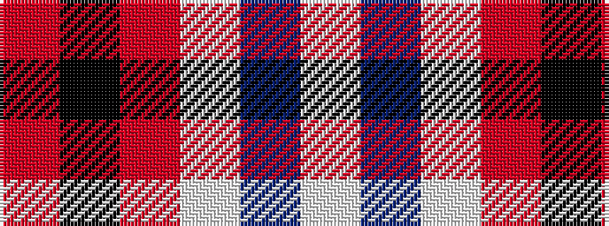

RKRWBW

It is a 6 stripe tartan.

<figure class="pat-woven">

<figcaption>idealised sample</figcaption>
</figure>

## Colour Sequence



## Tartans with this colour sequence

| Tartans |
|---------------|
| [Meg, Merrilees](/setts/s6/w23db6w6r5k35r10~x2/)|
||
| [Merrilees](/setts/s6/w23t6w6r5k35r10~x2/)|
||
