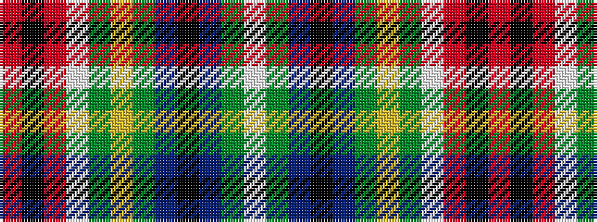

RKRWGYGBKBGW

It is a 12 stripe tartan.

<figure class="pat-woven">

<figcaption>idealised sample</figcaption>
</figure>

## Colour Sequence



## Tartans with this colour sequence

| Tartans |
|---------------|
| [Strathclyde Fire Services (Corporate](/variants/s12/r37k3r7w3dg3ly3dg2db10k6db3dg3w4~x2/)|
||
