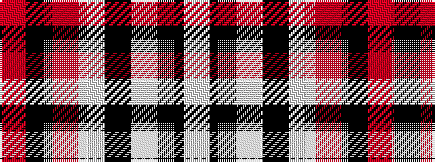

RKRWKWKW

It is a 8 stripe tartan.

<figure class="pat-woven">

<figcaption>idealised sample</figcaption>
</figure>

## Colour Sequence



## Tartans with this colour sequence

| Tartans |
|---------------|
| [O'Sullivan-Beare (Family)](/variants/s8/lb40k3lb3k3lb3o8k24o8~x2/)|
||
