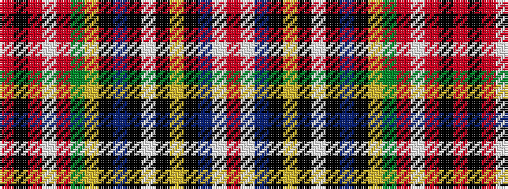

RKRWRGYKBKWKYKBWR

It is a 17 stripe tartan.

<figure class="pat-woven">

<figcaption>idealised sample</figcaption>
</figure>

## Colour Sequence



## Tartans with this colour sequence

| Tartans |
|---------------|
| [Wilson's No.156](/variants/s17/r30w2t4k4ly2k2w6k2t11k15ly3g20r14w4r4k2r8~x2/)|
||
