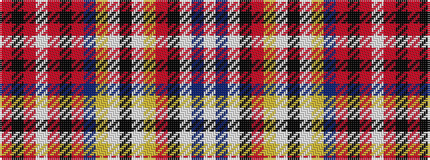

RKRWRKRBYWKWYRKWBW

It is a 18 stripe tartan.

<figure class="pat-woven">

<figcaption>idealised sample</figcaption>
</figure>

## Colour Sequence



## Tartans with this colour sequence

| Tartans |
|---------------|
| [Jacobite, Old sett](/setts/s18/r9k1r3w5r6k5r4dr8ly4w1k1w1ly4r6k1w2t1w2~x2/)|
||
