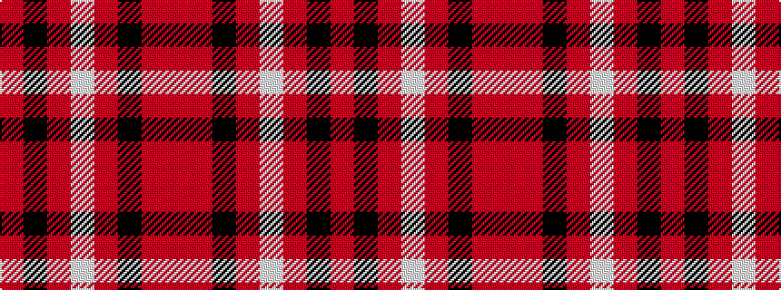

RKRWRKRR

It is a 8 stripe tartan.

<figure class="pat-woven">

<figcaption>idealised sample</figcaption>
</figure>

## Colour Sequence



## Tartans with this colour sequence

| Tartans |
|---------------|
| [Daks](/setts/s8/oi3k7oi2w2o12k2o2oi3~x2/)|
||
