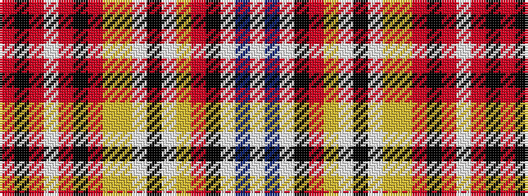

RKRWRKRYYWKWYRKWBW

It is a 18 stripe tartan.

<figure class="pat-woven">

<figcaption>idealised sample</figcaption>
</figure>

## Colour Sequence



## Tartans with this colour sequence

| Tartans |
|---------------|
| [Jacobite Old Sett](/setts/s18/r9k1r3w5r6k5r4lo8ly4w1k1w1ly4r6k1w2t1w2~x2/)|
||
| [Jacobite Old Sett (Artefact)](/setts/s18/r11k4r6w8r16k13r4lo12ly6w2k3w2ly6r7k4w3t3w2~x2/)|
||
