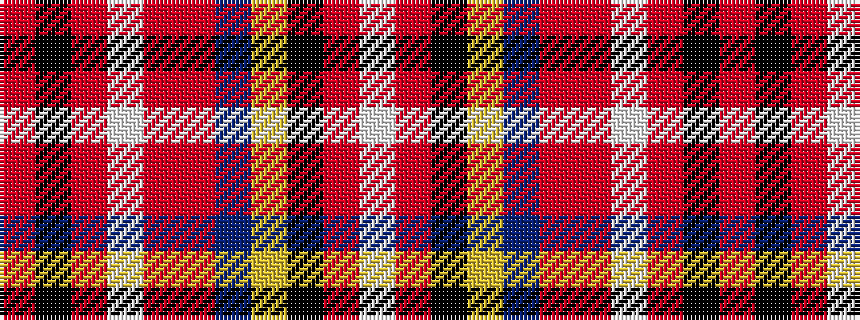

RKRWRRBYKRW

It is a 11 stripe tartan.

<figure class="pat-woven">

<figcaption>idealised sample</figcaption>
</figure>

## Colour Sequence



## Tartans with this colour sequence

| Tartans |
|---------------|
| [Calgary](/setts/s11/r40k5r4w2r8o2db3lo1k30r3w1~x2/)|
||
