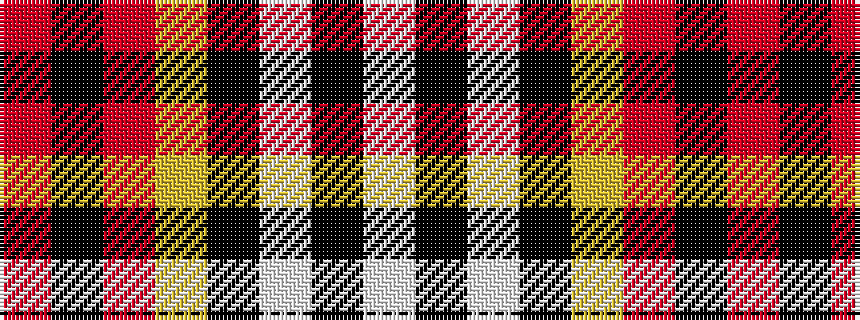

RKRYKWKW

It is a 8 stripe tartan.

<figure class="pat-woven">

<figcaption>idealised sample</figcaption>
</figure>

## Colour Sequence



## Tartans with this colour sequence

| Tartans |
|---------------|
| [Sutherland de Albergaria (Personal)](/setts/s8/w10k2w2k66ly6r48k5r8/)|
||
