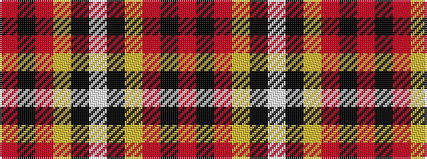

RKRYKWKYRKR

It is a 11 stripe tartan.

<figure class="pat-woven">

<figcaption>idealised sample</figcaption>
</figure>

## Colour Sequence



## Tartans with this colour sequence

| Tartans |
|---------------|
| [Wells Red, Greg (Personal)](/setts/s11/o12k2o12ly2k12w1k12ly2m12k2m12~x2/)|
||
