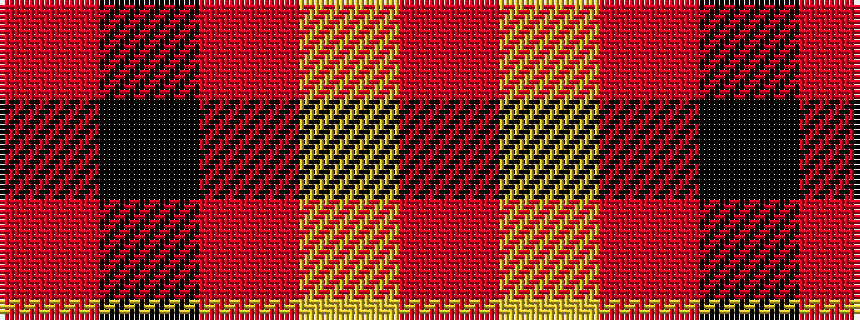

RKRYR

It is a 5 stripe tartan.

<figure class="pat-woven">

<figcaption>idealised sample</figcaption>
</figure>

## Colour Sequence



## Tartans with this colour sequence

| Tartans |
|---------------|
| [Ikelman #4 (Personal)](/variants/s5/r11k4r4lo4r11~x4/)|
||
