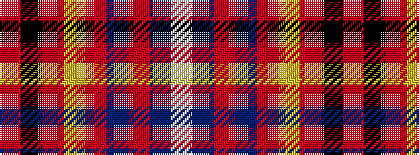

RKRYRBRBW

It is a 9 stripe tartan.

<figure class="pat-woven">

<figcaption>idealised sample</figcaption>
</figure>

## Colour Sequence



## Tartans with this colour sequence

| Tartans |
|---------------|
| [Stenhousemuir F.C.](/variants/s9/m6k2m4ly3m60db14m3db3w1~x2/)|
||
| [Stenhousemuir Football Club (Sports)](/variants/s9/r6k2r4ly3r60db14r3db3w1~x2/)|
||
