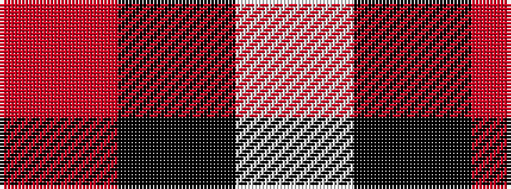

RKW

It is a 3 stripe tartan.

<figure class="pat-woven">

<figcaption>idealised sample</figcaption>
</figure>

## Colour Sequence



## Tartans with this colour sequence

| Tartans |
|---------------|
| [Hose](/setts/s3/w37k2r36~x2/)|
||
| [Hose (Dunmore)](/setts/s3/r13k1lb13~x4/)|
||
