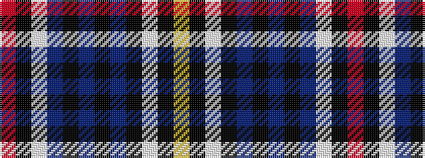

RKWBKBKBKWKY

It is a 12 stripe tartan.

<figure class="pat-woven">

<figcaption>idealised sample</figcaption>
</figure>

## Colour Sequence



## Tartans with this colour sequence

| Tartans |
|---------------|
| [MacEwan Arisaid (Dance)](/setts/s12/r3k2w18db18k3db3k3db18k18w18k2lo3~x2/)|
||
