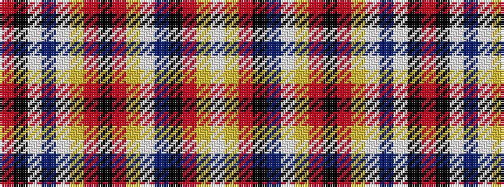

RKWBWYRKRYWBKRYW

It is a 16 stripe tartan.

<figure class="pat-woven">

<figcaption>idealised sample</figcaption>
</figure>

## Colour Sequence



## Tartans with this colour sequence

| Tartans |
|---------------|
| [MacGlashan (Clan?)](/setts/s16/r24k2w2n6w2lo2r2k2r2lo2w2b6k2r3lo3w2~x2/)|
||
