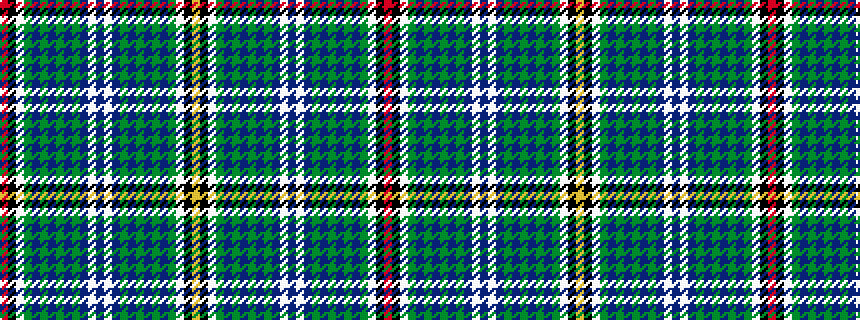

RKWGBGBGBGBWBWBGBGBGBGWKY

It is a 25 stripe tartan.

<figure class="pat-woven">

<figcaption>idealised sample</figcaption>
</figure>

## Colour Sequence



## Tartans with this colour sequence

| Tartans |
|---------------|
| [Recovery Dress](/variants/s25/r1k1w8dg1dt1dg1dt1dg1dt1dg1dt8w1dt2w1dt8dg1dt1dg1dt1dg1dt1dg1w8k1lo1~x4/)|
||
