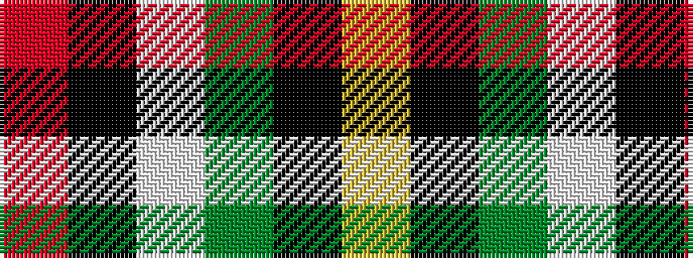

RKWGKY

It is a 6 stripe tartan.

<figure class="pat-woven">

<figcaption>idealised sample</figcaption>
</figure>

## Colour Sequence



## Tartans with this colour sequence

| Tartans |
|---------------|
| [Braemar Royal Highland Gathering](/setts/s6/r3k4lb2g64k6ly3~x2/)|
||
| [Brandon (Manitoba)](/setts/s6/o84k35w3g35k3ly10/)|
||
