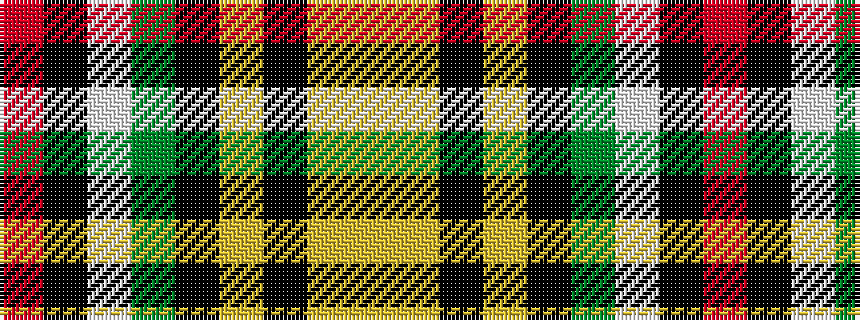

RKWGKYKYY

It is a 9 stripe tartan.

<figure class="pat-woven">

<figcaption>idealised sample</figcaption>
</figure>

## Colour Sequence



## Tartans with this colour sequence

| Tartans |
|---------------|
| [Louth County Crest (Fashion)](/setts/s9/ly16lo5k8lo8k68g46w8k8r8/)|
||
