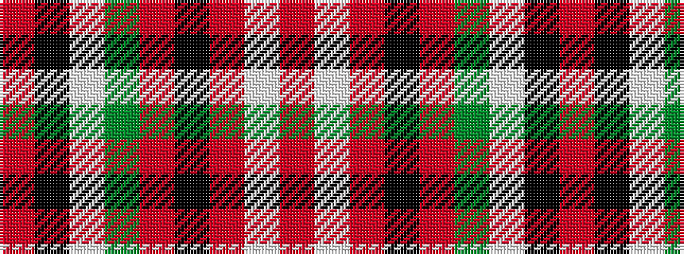

RKWGRKRWR

It is a 9 stripe tartan.

<figure class="pat-woven">

<figcaption>idealised sample</figcaption>
</figure>

## Colour Sequence



## Tartans with this colour sequence

| Tartans |
|---------------|
| [Unidentified #58](/setts/s9/r4k12lb1dg6r3k1r3lb1r3~x4/)|
||
