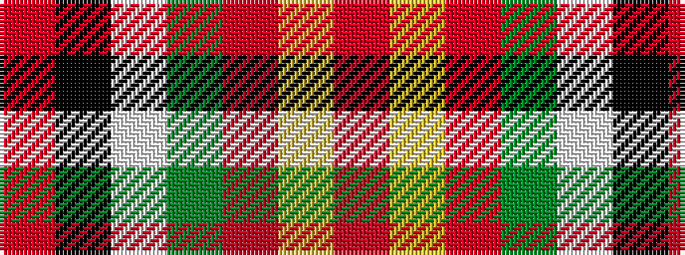

RKWGRYR

It is a 7 stripe tartan.

<figure class="pat-woven">

<figcaption>idealised sample</figcaption>
</figure>

## Colour Sequence



## Tartans with this colour sequence

| Tartans |
|---------------|
| [Barbour](/setts/s7/r3k20w2dy11o21ly2o2~x2/)|
||
| [Barbour - Classic](/setts/s7/o4ly2o21dy11w2k20r3~x2/)|
||
