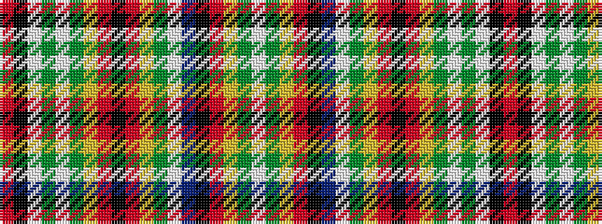

RKWGWGYRKRYGWBKRYGW

It is a 19 stripe tartan.

<figure class="pat-woven">

<figcaption>idealised sample</figcaption>
</figure>

## Colour Sequence



## Tartans with this colour sequence

| Tartans |
|---------------|
| [Chattan Clan Tartan Tartan Number: 1620. Earliest known date: pre 2003 This sett includes a brown stripe next to the yellow which does not appear in the records of Lord Lyon. The sett is similar in other respects. See products available Copyright © Blair Urquhart, Comrie, 2015](/setts/s19/r36k2w1g18w1dy2ly2r3k1r3ly2dy2w1t18k5r4ly5dy2w2~x2/)|
||
| [MacKintosh #8](/setts/s19/r24k1w1dg6w1dg1ly2r2k1r2ly2dg1w1t6k2r3ly3dg2w1~x2/)|
||
| [MacKintosh 7](/setts/s19/r24k1w1g6w1g1ly2r2k1r2ly2g1w1t6k2r3ly3g2w1~x2/)|
||
