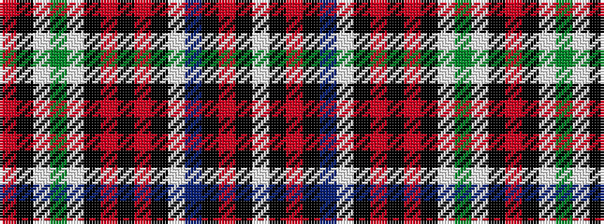

RKWGWKRKRKWBKRKW

It is a 16 stripe tartan.

<figure class="pat-woven">

<figcaption>idealised sample</figcaption>
</figure>

## Colour Sequence



## Tartans with this colour sequence

| Tartans |
|---------------|
| [Chattan, Clan](/setts/s16/r120ki4w2g32w4k7r7ki2r7k7w4t32ki8r8k12w4/)|
||
