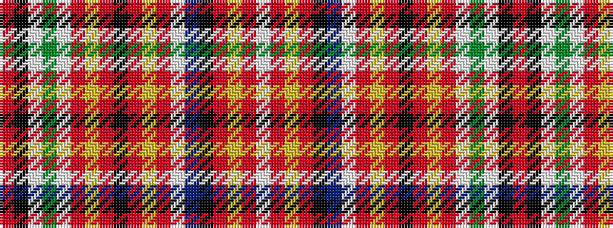

RKWGWRYRKRYRWBKRYRW

It is a 19 stripe tartan.

<figure class="pat-woven">

<figcaption>idealised sample</figcaption>
</figure>

## Colour Sequence



## Tartans with this colour sequence

| Tartans |
|---------------|
| [Chattan](/variants/s19/r36k2w1g18w1o2ly2r3k1r3ly2o2w1t18k5r4ly5o2w2~x2/)|
||
| [Chattan (brown stripe variation)](/variants/s19/r36k2w1dg18w1o2ly2r3k1r3ly2o2w1t18k5r4ly5o2w2~x2/)|
||
