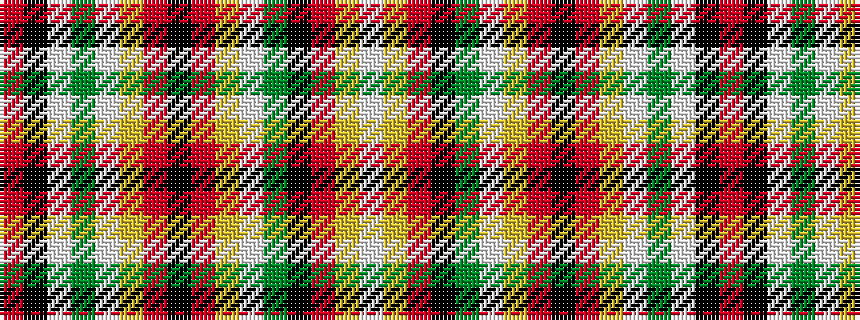

RKWGWYRKRYWGKRYW

It is a 16 stripe tartan.

<figure class="pat-woven">

<figcaption>idealised sample</figcaption>
</figure>

## Colour Sequence



## Tartans with this colour sequence

| Tartans |
|---------------|
| [MacKintosh 8](/setts/s16/r94k3w2g21w3ly3r5k2r5ly3w3y21k7r7ly8w4~x2/)|
||
