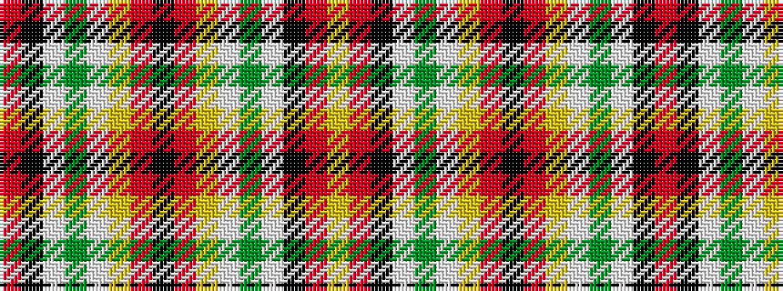

RKWGWYRKRYWGWKRY

It is a 16 stripe tartan.

<figure class="pat-woven">

<figcaption>idealised sample</figcaption>
</figure>

## Colour Sequence



## Tartans with this colour sequence

| Tartans |
|---------------|
| [Chattan](/setts/s16/r11k1w1g4w1ly1r1k1r1ly1w1g4w1k1r1ly3~x2/)|
||
| [Chattan (variation)](/setts/s16/r11k1w1dg4w1ly1r1k1r1ly1w1dg4w1k1r1ly3~x2/)|
||
