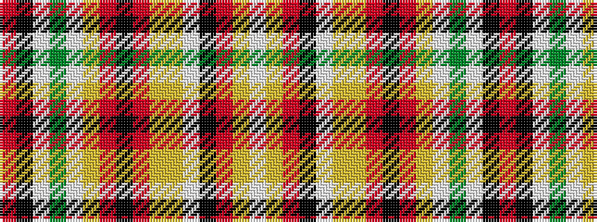

RKWGWYRKRYYWKRYW

It is a 16 stripe tartan.

<figure class="pat-woven">

<figcaption>idealised sample</figcaption>
</figure>

## Colour Sequence



## Tartans with this colour sequence

| Tartans |
|---------------|
| [Clan Chattan D](/setts/s16/r60k2lb1dg16lb2ly3r3k1r3ly3lr2lb16k4r4ly6lb2/)|
||
