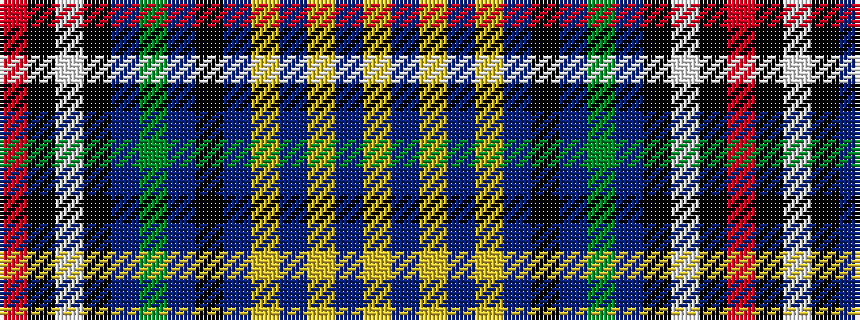

RKWKBGBKBYBYBY

It is a 14 stripe tartan.

<figure class="pat-woven">

<figcaption>idealised sample</figcaption>
</figure>

## Colour Sequence



## Tartans with this colour sequence

| Tartans |
|---------------|
| [Wupper Pipes & Drums (Corporate)](/variants/s14/r2k4w1k4db18g1db18k6db3ly1db2ly1db2ly2~x2/)|
||
