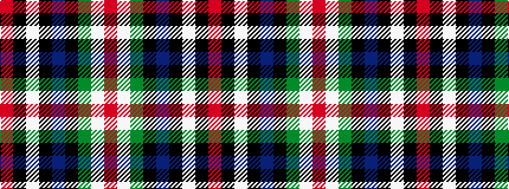

RKWKBKGWR

It is a 9 stripe tartan.

<figure class="pat-woven">

<figcaption>idealised sample</figcaption>
</figure>

## Colour Sequence



## Tartans with this colour sequence

| Tartans |
|---------------|
| [Italian American](/variants/s9/r4k2w6k2db40k80dg10w6r3/)|
||
| [Italian American (Corporate)](/variants/s9/r4k2w6k2b40k80g10w6r3/)|
||
