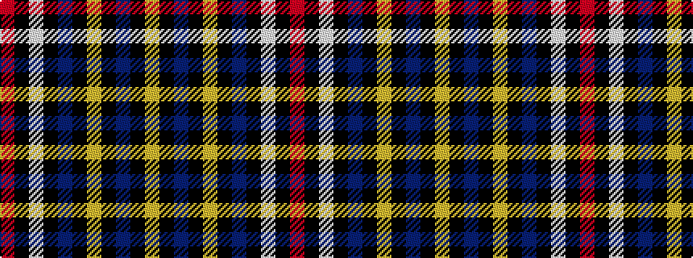

RKWKBKYKBKY

It is a 11 stripe tartan.

<figure class="pat-woven">

<figcaption>idealised sample</figcaption>
</figure>

## Colour Sequence



## Tartans with this colour sequence

| Tartans |
|---------------|
| [Williams Dress (Carolinas) (Personal)](/variants/s11/r5k1w3k6t5k2ly3k45t4k2ly3~x2/)|
||
| [Williams Dress (Personal)](/variants/s11/r5k1w3k6n5k2ly3k45n4k2ly3~x2/)|
||
