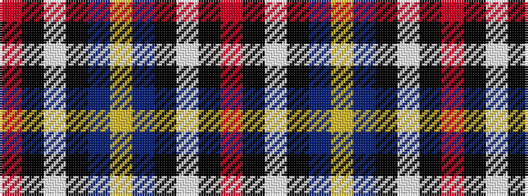

RKWKBYBKWKR

It is a 11 stripe tartan.

<figure class="pat-woven">

<figcaption>idealised sample</figcaption>
</figure>

## Colour Sequence



## Tartans with this colour sequence

| Tartans |
|---------------|
| [Dauphinee (Personal)](/setts/s11/r9k4w6k4db21lo3db13k2w4k2r6~x2/)|
||
| [Dauphinee (Trussville, Alabama) (Personal)](/setts/s11/r9k4w6k4dt21ly3dt13k2w4k2r6~x2/)|
||
