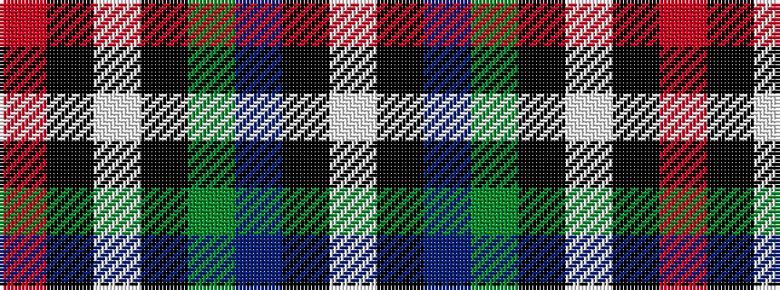

RKWKGBKW

It is a 8 stripe tartan.

<figure class="pat-woven">

<figcaption>idealised sample</figcaption>
</figure>

## Colour Sequence



## Tartans with this colour sequence

| Tartans |
|---------------|
| [Hislop (Name)](/variants/s8/w4k2t18g18k18wi3k18r3~x2/)|
||
