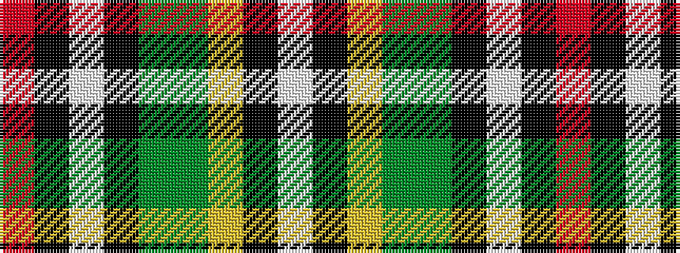

RKWKGGYKW

It is a 9 stripe tartan.

<figure class="pat-woven">

<figcaption>idealised sample</figcaption>
</figure>

## Colour Sequence



## Tartans with this colour sequence

| Tartans |
|---------------|
| [Madewell](/variants/s9/r2k2w2k14dg13g6ly2k2w2~x2/)|
||
