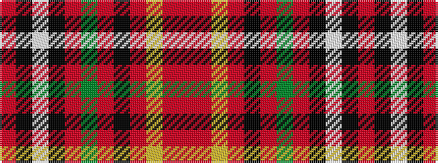

RKWKRGRKRYRR

It is a 12 stripe tartan.

<figure class="pat-woven">

<figcaption>idealised sample</figcaption>
</figure>

## Colour Sequence



## Tartans with this colour sequence

| Tartans |
|---------------|
| [Hudson's Bay Company](/variants/s12/r2k34w2k2o27g1o2k3o2ly1o2r2~x2/)|
||
