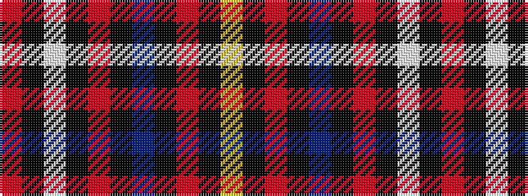

RKWKRKBKRKY

It is a 11 stripe tartan.

<figure class="pat-woven">

<figcaption>idealised sample</figcaption>
</figure>

## Colour Sequence



## Tartans with this colour sequence

| Tartans |
|---------------|
| [Andreou Family (Personal)](/variants/s11/r1k2w8k2r1k2db8k2r1k2ly1~x4/)|
||
