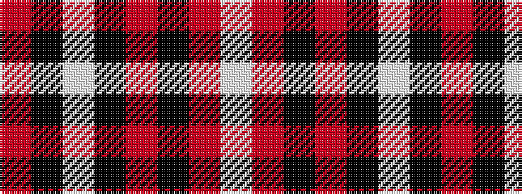

RKWKRKRW

It is a 8 stripe tartan.

<figure class="pat-woven">

<figcaption>idealised sample</figcaption>
</figure>

## Colour Sequence



## Tartans with this colour sequence

| Tartans |
|---------------|
| [Las Vegas Fire Fighters](/setts/s8/r1k3lb2k28r30k1r2lb1~x2/)|
||
