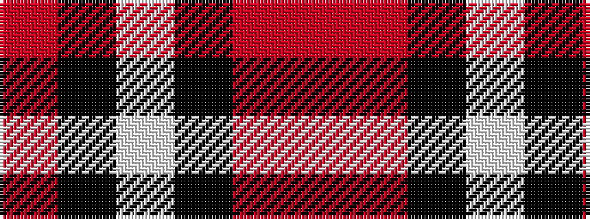

RKWKRR

It is a 6 stripe tartan.

<figure class="pat-woven">

<figcaption>idealised sample</figcaption>
</figure>

## Colour Sequence



## Tartans with this colour sequence

| Tartans |
|---------------|
| [Downside (Corporate)](/variants/s6/r4o41k5w14k18r4~x2/)|
||
| [Thompson Grey Dress](/variants/s6/r1o6k1w3k3r1~x8/)|
||
| [Thompson Grey Family Tartan](/variants/s6/r2o20k5w10k10r2~x2/)|
||
