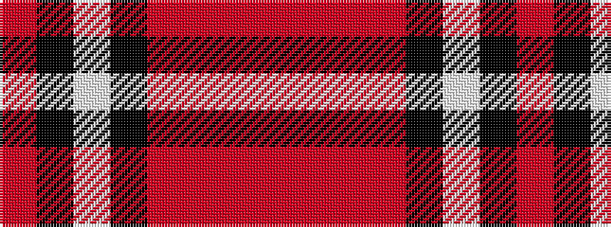

RKWKRRRR

It is a 8 stripe tartan.

<figure class="pat-woven">

<figcaption>idealised sample</figcaption>
</figure>

## Colour Sequence



## Tartans with this colour sequence

| Tartans |
|---------------|
| [Sidney (Nova Scotia) Canadian Tartan](/variants/s8/r16o2r11o6k4w2k4o16~x2/)|
||
| [Sydney (Nova Scotia) (District)](/variants/s8/o16oi2o11oi6k4w2k4oi16~x2/)|
||
