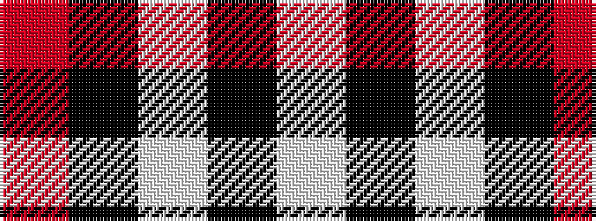

RKWKW

It is a 5 stripe tartan.

<figure class="pat-woven">

<figcaption>idealised sample</figcaption>
</figure>

## Colour Sequence



## Tartans with this colour sequence

| Tartans |
|---------------|
| [Cornish Flag (District)](/setts/s5/w5k20w10k1r2~x2/)|
||
| [Havel](/setts/s5/r21k21w10k10w21~x2/)|
||
