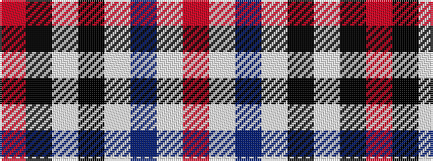

RKWKWBWR

It is a 8 stripe tartan.

<figure class="pat-woven">

<figcaption>idealised sample</figcaption>
</figure>

## Colour Sequence



## Tartans with this colour sequence

| Tartans |
|---------------|
| [Inverness - 2000 (Fashion)](/variants/s8/r64k8w3k8w3b4w3r18~x2/)|
||
