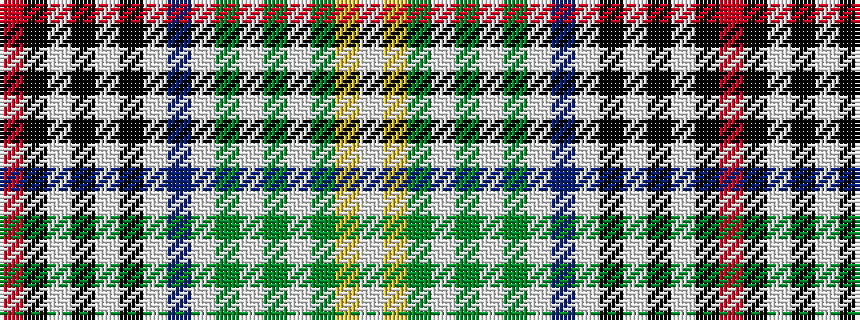

RKWKWKWBWGWGWGYW

It is a 16 stripe tartan.

<figure class="pat-woven">

<figcaption>idealised sample</figcaption>
</figure>

## Colour Sequence



## Tartans with this colour sequence

| Tartans |
|---------------|
| [Clanedin/Commonwealth](/variants/s16/r3k8lb2k3lb2k2lb6db3lb6dy2lb2dy3lb2dy4ly10lb3~x2/)|
||
