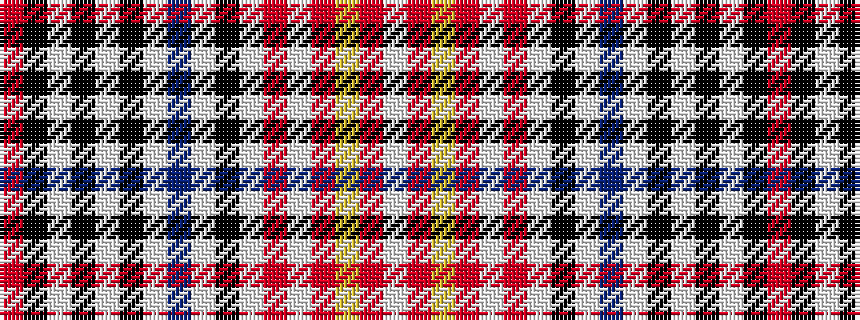

RKWKWKWBWKWRWRYRW

It is a 17 stripe tartan.

<figure class="pat-woven">

<figcaption>idealised sample</figcaption>
</figure>

## Colour Sequence



## Tartans with this colour sequence

| Tartans |
|---------------|
| [Clanedin](/setts/s17/r3k8w2k3w2k2w6db3w6k2w2o3w2o4ly2o10w3~x2/)|
||
