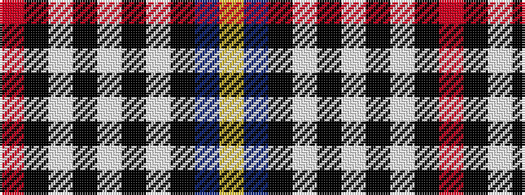

RKWKWKWKBY

It is a 10 stripe tartan.

<figure class="pat-woven">

<figcaption>idealised sample</figcaption>
</figure>

## Colour Sequence



## Tartans with this colour sequence

| Tartans |
|---------------|
| [Thom(p)son](/setts/s10/r1k1w2k2w2k1w4k1db9ly1~x4/)|
||
| [Thompson Variant](/setts/s10/r1k1lb2k2lb2k1lb4k1db9lo1~x4/)|
||
