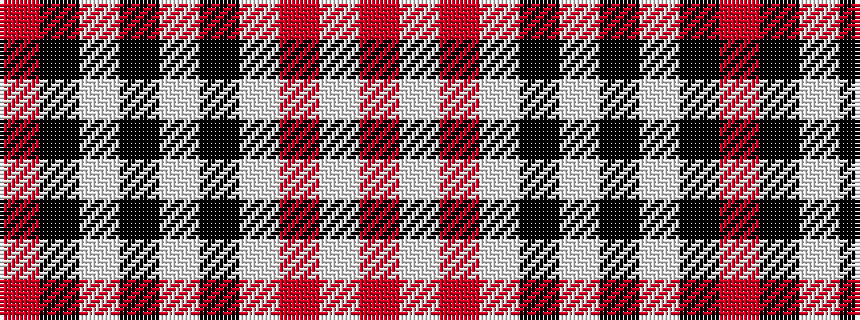

RKWKWKWRWR

It is a 10 stripe tartan.

<figure class="pat-woven">

<figcaption>idealised sample</figcaption>
</figure>

## Colour Sequence



## Tartans with this colour sequence

| Tartans |
|---------------|
| [Myles, Lee (Name)](/setts/s10/r2lb3r1lb9k4lb13k33lb1k4r1~x2/)|
||
