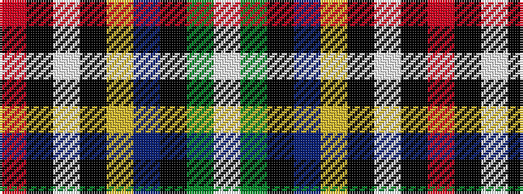

RKWKYBKGW

It is a 9 stripe tartan.

<figure class="pat-woven">

<figcaption>idealised sample</figcaption>
</figure>

## Colour Sequence



## Tartans with this colour sequence

| Tartans |
|---------------|
| [Dean/Dundas (Personal)](/setts/s9/r17k5w4k6ly5db31k5g6w3~x2/)|
||
