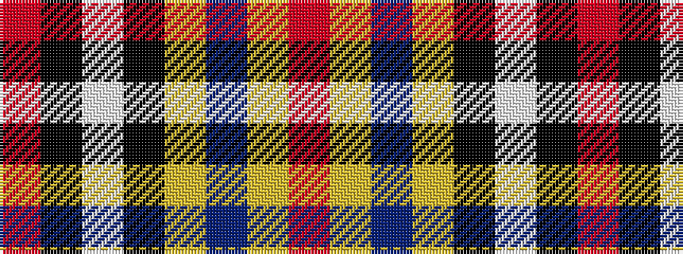

RKWKYBYR

It is a 8 stripe tartan.

<figure class="pat-woven">

<figcaption>idealised sample</figcaption>
</figure>

## Colour Sequence



## Tartans with this colour sequence

| Tartans |
|---------------|
| [Princess Elizabeth](/variants/s8/r42k4w1k6ly1db1ly1r12~x2/)|
||
| [Princess Elizabeth (Royal)](/variants/s8/r72k6lb2k11ly2db2ly2r18~x2/)|
||
