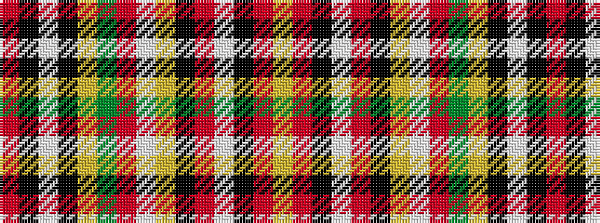

RKWKYGRWYKRWKRY

It is a 15 stripe tartan.

<figure class="pat-woven">

<figcaption>idealised sample</figcaption>
</figure>

## Colour Sequence



## Tartans with this colour sequence

| Tartans |
|---------------|
| [Purdy, R Scott (Personal)](/variants/s15/r1k1w1k1lo6dg3o7w1lo12k1r21w1k1r1lo1~x2/)|
||
