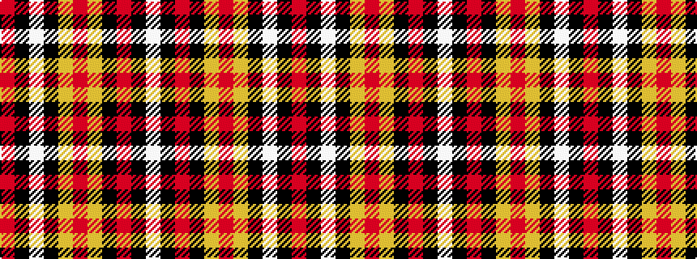

RKWKYRYKRKW

It is a 11 stripe tartan.

<figure class="pat-woven">

<figcaption>idealised sample</figcaption>
</figure>

## Colour Sequence



## Tartans with this colour sequence

| Tartans |
|---------------|
| [Glennie (Personal)](/variants/s11/r48k1lb1k6ly4r2ly4k8r2k1lb2~x2/)|
||
