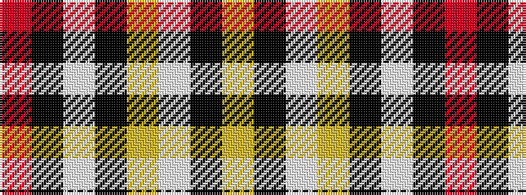

RKWKYWKY

It is a 8 stripe tartan.

<figure class="pat-woven">

<figcaption>idealised sample</figcaption>
</figure>

## Colour Sequence



## Tartans with this colour sequence

| Tartans |
|---------------|
| [Cunard o' the Clyde](/setts/s8/r10k3w1k15ly1w3k3ly1~x4/)|
||
