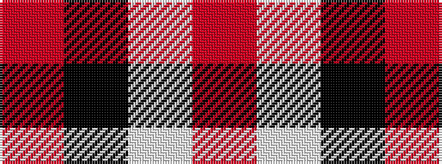

RKWR

It is a 4 stripe tartan.

<figure class="pat-woven">

<figcaption>idealised sample</figcaption>
</figure>

## Colour Sequence



## Tartans with this colour sequence

| Tartans |
|---------------|
| [Buckeye](/variants/s4/o25k4w8r16~x4/)|
||
| [Dobelman (Personal)](/variants/s4/r1k20lb5r1~x4/)|
||
| [Oklahoma State University](/variants/s4/o80k52w7oi12/)|
||
| [Oklahoma State University (Corporate](/variants/s4/r80k52w7o12/)|
||
